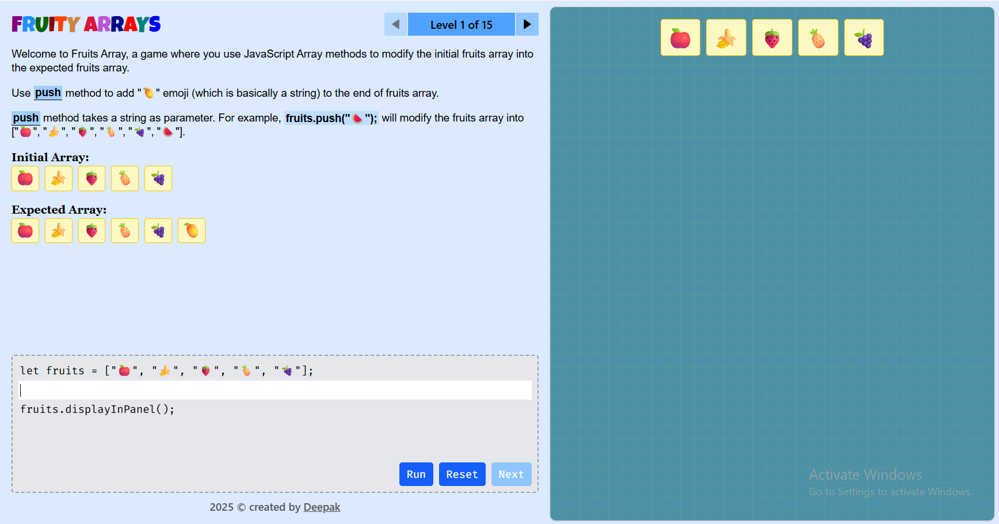

# 🍉 Fruity Arrays

**Fruity Arrays** is a fun, interactive web app to learn and practice **JavaScript array methods** — like `push()`, `pop()`, `shift()`, and more — through visual feedback and real-time code execution.  
Whether you're a beginner learning arrays or a developer testing your skills, this mini-game makes it engaging and satisfying! 🚀

---

## 🎮 Live Demo  
👉 [https://fruityarrays.netlify.app/](https://fruityarrays.netlify.app/){:target="_blank"}

---

## 🖼️ Preview

<!-- Replace the file path below with your screenshot -->

---

## 🧠 Features

- 💡 Learn core **JavaScript array methods** interactively  
- 🍎 Visual feedback for every code change  
- 🔄 Animations for array updates (push, pop, shift, unshift, etc.)  
- 🧩 Multiple levels to test your logic and progress  
- 💬 Instant success/error messages via `react-hot-toast`  
- ⚡ Built with modern React tools and state management  

---

## 🛠️ Tech Stack

- **React** (with Vite)
- **Zustand** – global state management
- **Tailwind CSS** – fast and flexible styling
- **React Hot Toast** – sleek alert system
- **React Icons** – clean and lightweight icons

---

### 🌟 Made with love (and fruits) by [Deepak](https://github.com/deepak-kr-patra){:target="_blank"} 
